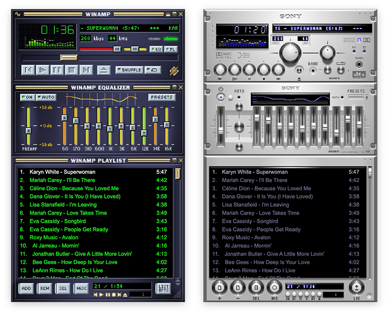

<div align="center">

# McAmp

### Classic Winamp 2.x, reborn as a native macOS app

No Electron. No web views. Just Swift, AppKit, and nostalgia.


[](https://swift.org)
[](https://www.apple.com/macos)
[](McAmp/UI)
[-2ea44f)](#tech-stack)

</div>


## ✨ Highlights

- **Real Winamp skins** — load any classic `.wsz` skin and the entire app reskins: sprites, bitmap fonts, playlist colors, visualizer palette
- **Support for Webradio stremas** - play webradio streams in playlists `.m3u`, `m3u8`, `.pls` from your favorite stations.
- **Gapless CUE playback** — one FLAC + `.cue` becomes individual tracks with sample-accurate, gapless transitions
- **Jump to File** — incremental search over 10k-track playlists in under 16 ms


## 🎨 Skins

McAmp parses the original Winamp 2.x skin format — a `.wsz` archive of bitmap
sprites and INI files.

A few classics to try live in [`skins/`](skins): *base-2.91*, *ExpensiveHi-Fi*.

<div align="center">



</div>


## 📜 Playlist

- Drag & drop files, folders, `.m3u`/`.m3u8`, `.pls` and `.cue` straight from Finder
- Multi-select like a real Mac app — Shift-click ranges, Cmd-click toggles, `⌘A`, Backspace removes
- Instant search box + **Jump to File** (`⌘J`) with prefix → word-boundary → substring ranking
- **Import from Music Library…** — pulls local tracks and playlists from Music.app
  (via `ITLibrary`, with an `iTunes Music Library.xml` fallback); streaming-only and
  missing files are skipped and counted

## Webradio streams

Play your favorite webradio stations from `m3u`, `m3u8` or `.pls`playlists.

## 💿 CUE sheets, done properly

Drop a `.cue` next to a FLAC (or open a FLAC with an embedded `CUESHEET`
Vorbis comment) and the album splits into individual virtual tracks:

- Gapless transitions between consecutive tracks via chained `scheduleSegment` calls
- External `.cue` wins over embedded CUESHEET

## ⌨️ Keyboard shortcuts

| Playback | | View | |
|---|---|---|---|
| `Space` | Play / Pause | `⌘1` | Show Player |
| `⌘.` | Stop | `⌘2` | Toggle Equalizer |
| `⌘→` / `⌘←` | Next / Previous | `⌘3` | Toggle Playlist |
| `⌘R` | Repeat | `⌘⇧D` | Double Size |
| `⌘S` | Shuffle | `⌘⇧T` | Always on Top |
| `Return` | Play selected track | `⌘⇧S` | Load Skin… |
| `↑` `↓` | Navigate playlist | `⌘O` | Open File, Folder, Lists |
| `⌘J` | Jump to File… | `⌘A` | Select All |


## ⌨️ Hardware Media Keys

Play/Pause, Next, Previous 

## 📦 Supported formats

| Audio | Playlists |
|---|---|
| MP3 · AAC · M4A · FLAC · WAV · AIFF | M3U · M3U8 · PLS · CUE (external & FLAC-embedded) |

## 🚀 Getting started

### Download

Grab the latest `McAmp-<version>-macOS-arm64.dmg` from
[**Releases**](https://github.com/lisanet/macamp/releases), open it and drag
McAmp to Applications. Requires macOS 26.3+ on Apple Silicon.

The app is ad-hoc signed, not notarized, so the first launch is blocked with
*"Apple could not verify McAmp is free of malware"*. Click **Done**, then go to
**System Settings → Privacy & Security** and click **Open Anyway** — once.
Terminal alternative:

```bash
xattr -c /Applications/McAmp.app
```

### Build from source

**Requirements:** macOS 26.3+, Xcode 26+

```bash
git clone https://github.com/lisanet/macamp.git
cd mcamp

# Build
xcodebuild -project McAmp.xcodeproj -scheme McAmp -configuration Debug build

# Or just open in Xcode and hit ⌘R
open McAmp.xcodeproj
```

## 🙅 Non-goals

McAmp is a player for your local files and for webradio streams. 

It will not stream Spotify or Apple Music catalog
tracks — both route audio through a system-managed graph that bypasses our DSP,
so the EQ and spectrum analyzer would be lying to you. Details in
[docs/non-goals.md](docs/non-goals.md).

## Credits

This project startet as a fork of (https://github.com/wishval/wamp)[https://github.com/wishval/wamp] but has been
moved forward and included webradio strems, improved drawing of skin elements, reduced scaling artifacts, fixed various glitches, added some features, drop the unskinned mode more. So this project got renamed to `McAmp`
to better reflect the many changes and improvements it has gone through.

Anyway, without the original project, McAmp would have never seen the light of day, so credits got to it.

## 📬 License

MIT – feel free to use, modify, and distribute.

## 🤝 Contributing

Contributions, bug reports, and feature requests are welcome. Please open an issue or submit a pull request if you have any improvements or suggestions.

## ⚠️ Disclaimer

McAmp is provided 'as is' without any warranty.
Use at your own risk and ensure you have backups of your original media.